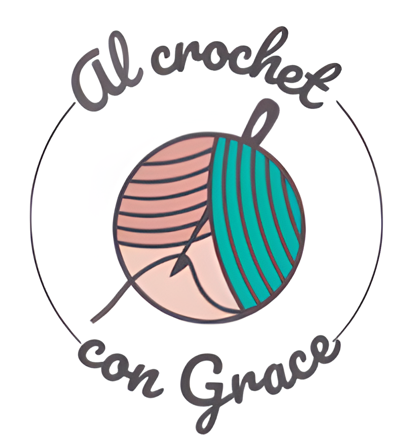

  </a>

# Al Crochet con Grace - ecommerce
 
Este proyecto fue realizado como entrega final del curso ReactJS de CoderHouse

## Sobre el proyecto
 
Decidi realizar el e-commerce del emprendimiento de mi mamá, por ende todos los datos e imágenes son reales. Se trata de productos hechos a mano con la tecnica de crochet.

## Dependencias y paquetes instalados 
####  <a href ="https://react-bootstrap.netlify.app/"> [React Boostrap] </a>
Escogi esta libreria para acelerar la creacion de estilos para mis componentes, sin embargo tambien estan creados mis propios archivos de css para el estilado del proyecto.
 
Instalacion: npm install react-bootstrap bootstrap
 
####  <a href ="https://react-icons.github.io/react-icons/"> [React Icons] </a>
Elegi esta libreria de iconos ya que es la mas usada y cuenta con variedad y un estilado que coincidia con el objetivo de mi proyecto
 
Instalacion: npm install react-icons --save
 
####  <a href ="https://reactrouter.com/en/main"> [React Router] </a>
Necesario para crear el routeado de nuestra SPA.
 
Instalacion: npm install react-router-dom localforage match-sorter sort-by
 
####  <a href ="https://sweetalert2.github.io/"> [Sweet Alert] </a>
Es una libreria que nos ofrece pop-ups muy esteticos y nos dan un decorado para la pagina muy lindo, además de entregar un mensaje claro luego de que el usuario realice determinada acción.
 
Instalacion: npm install sweetalert2
 
## Base de datos - Firebase
 

Utilice Firebase como base de datos para el proyecto como es pedido, donde cuenta con dos Collections, una para los productos realizada por mi transfiriendo los datos del en principio mock.js y otra donde son pusheadas las ordenes de los clientes mediante el formulario del CHECKOUT.
 

## Comandos
+ **npm start**: inicia el servidor local
 

# Componentes del proyecto - Checklist 
+ NavBar
+ CartWidget
+ Cart (Detalle del producto -imagen, precio, cantidad y boton deleteItem-)
+ Cart Context
+ ItemListContainer
+ ItemList
+ ItemDetailContainer (tamaño, demora, stock)
+ ItemDetail (Description del item)
+ ItemQuantity
+ Item
+ AddItemButton
+ Checkout
+ Brief (detalle de compra)
+ Formulario para realizar la compra (nombre, apellido, telefono, email y verificacion del email, todo pedido con required y el email con logica para que sea igual)

  # Requisitos extra
[x] **Cart persistente**. Usé localStorage a través de un UseEffect.

